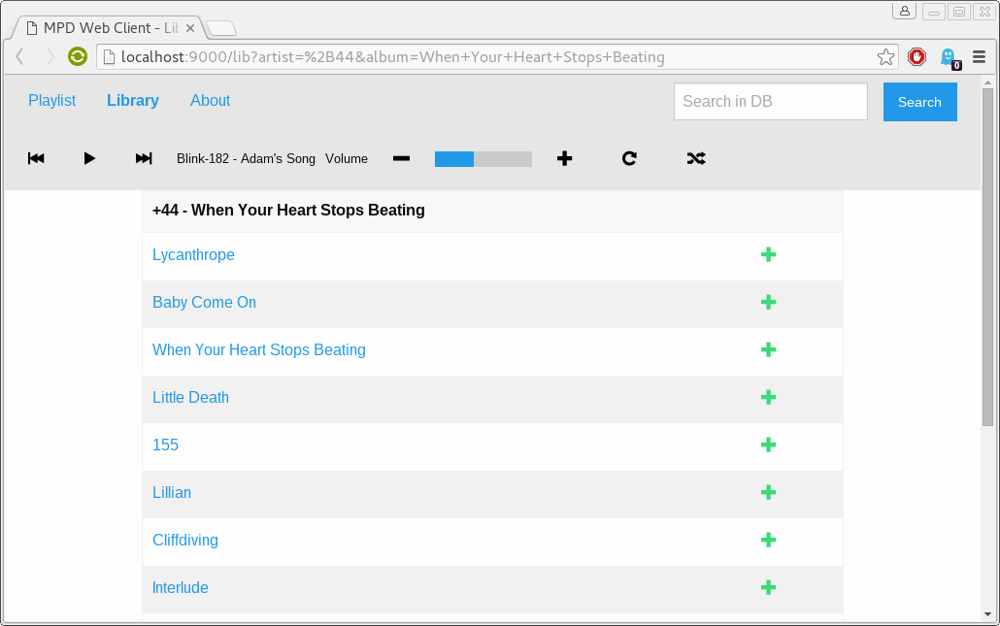

# Responsive mpd
### The usable web client for mpd.

This is a web-based and responsive client for the famous [mpd](http://www.musicpd.org/)-linux-daemon. This client was created with the ambition for a client which can be used from everywhere without installing any special software.

For example you could install mpd and this client on a Raspberry Pi and control the music-player from your PC, your Tablet or your Smartphone.

This client is written with the power of Scala, [Akka](http://akka.io/) and [Play!](https://www.playframework.com/)

# Get a taste
Playlist view:

Database view:


## Test, use it
For testing and using this project follow this steps:
- clone this repository
- change the ```conf/mpd.conf``` file to sweet your needs
- start the client via ```activator run```
- open up the client in a web-browser at ```http://<localhost>:9000```

# License
This software is licensed under the [Apache 2](http://www.apache.org/licenses/LICENSE-2.0) license.
