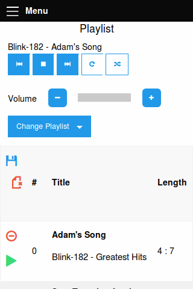

# Responsive mpd
### The usable web client for mpd.

This is a web-based and responsive client for the famous [mpd](http://www.musicpd.org/)-linux-daemon. This client was created with the ambition for a client which can be used from everywhere without installing any special software. All known web-based solutions got the major problem that they aren't usable from a smartphone, because they wasn't ever build for multiple systems.

You could install mpd and this client on a Raspberry Pi and control the music-player from your PC, your Tablet or your Smartphone without the need to know 2, 3 different clients.

This client is using the following frameworks/librarys:
- [Play!](https://www.playframework.com/)
(Web Framework - Apache 2 License)
- [Akka](http://akka.io/)
(Reactive Framework - Apache 2 License)
- [JavaMPD](http://www.thejavashop.net/javampd/)
(mpd protocol implementation in java - GPLv3)
- [Foundation 6](http://foundation.zurb.com/sites)
(A responsive front-end framework - MIT License)
- [jQuery](https://jquery.com/)
(JavaScript Library - MIT License)

# Get a taste
Playlist view:



Database view:


## Try it
If you like it and want to try it, follow this steps:
- clone this repository
- change the ```conf/mpd.conf``` file to sweet your needs
- start the client via ```activator run```
- open up the client in a web-browser at ```http://<serveradress>:9000```
